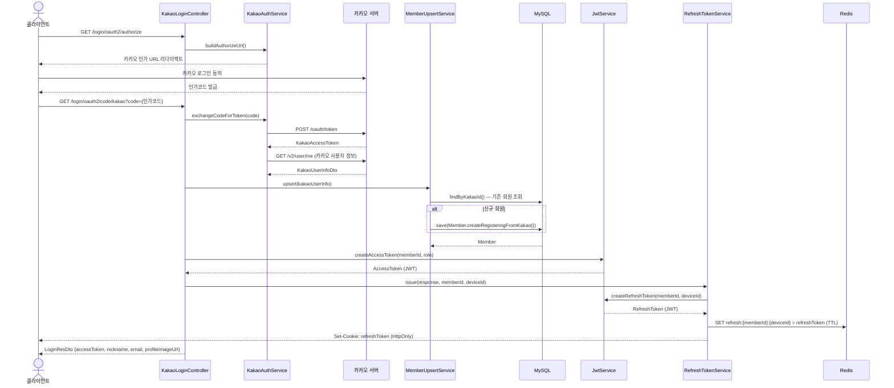
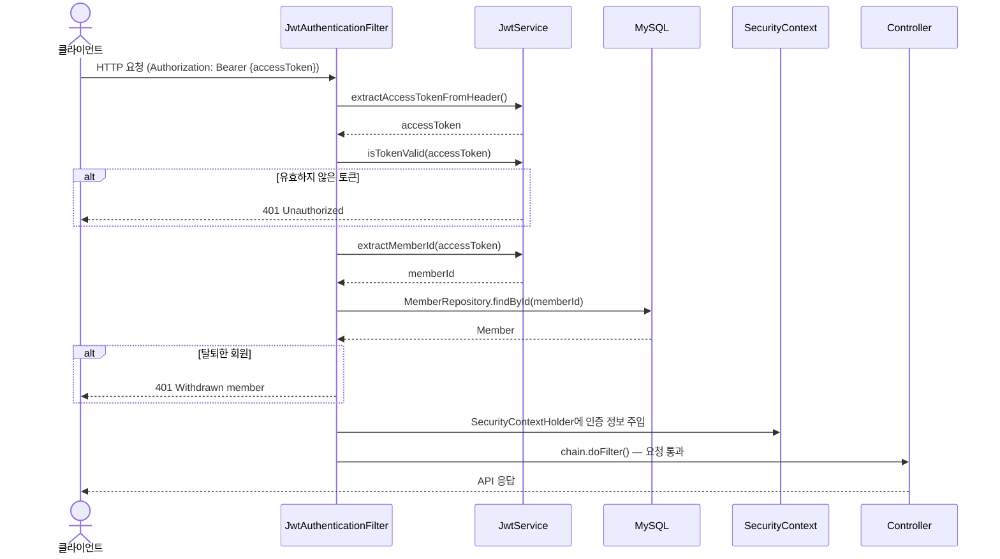
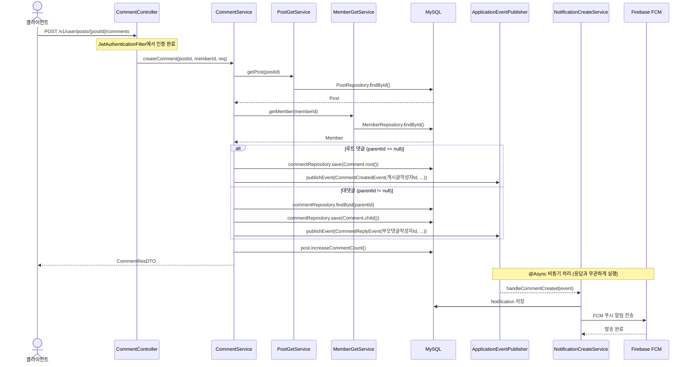
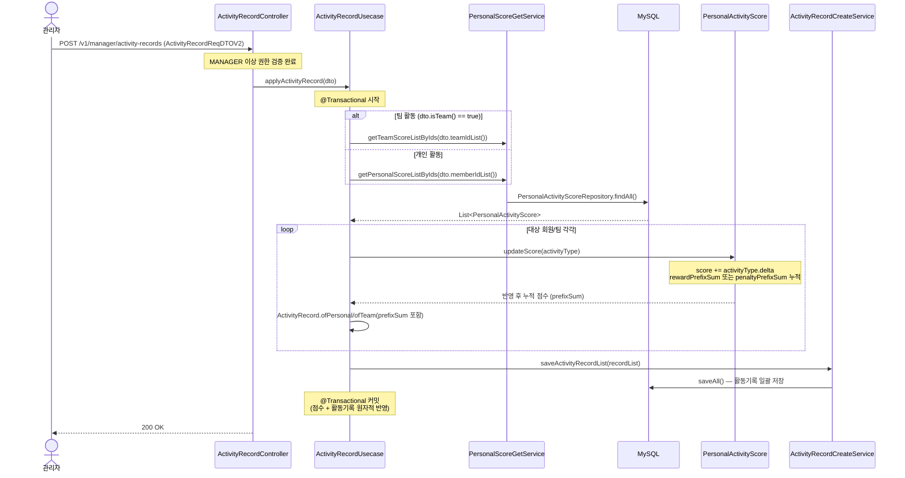

# 아키텍처 & 패턴 가이드

## 레이어 구조

```
Controller
    ↓
Usecase         ← 복합 로직 조합 + @Transactional
    ↓       ↘
Service      타 도메인 GetService (조회만 허용)
    ↓
Repository
```

- **Controller**: HTTP 요청/응답만 담당, 비즈니스 로직 없음
- **Usecase**: 여러 Service를 조합하는 단위. `@Transactional` 여기서 관리
- **Service**: 단일 도메인 내 CRUD 로직. 타 도메인 Service 호출 시 `GetService`만 허용
- **Repository**: JPA + QueryDSL. 타 도메인에서 직접 주입 금지

> Usecase가 필요 없는 단순 CRUD는 Controller → Service → Repository로 직접 연결

---

## 네이밍 컨벤션

| 구분 | 패턴 | 예시 |
|------|------|------|
| Service | `{Domain}{Action}Service` | `ActivityRecordCreateService` |
| Usecase | `{Domain}Usecase` | `ActivityRecordUsecase`, `MemberAdminUsecase` |
| Controller | `{Domain}{Action}Controller` | `BadgeCreateController` |
| DTO Request | `{Action}ReqDTO` | `ActivityRecordReqDTO` |
| DTO Response | `{Action}ResDTO` | `AdminActivityRecordResDTO` |
| Exception | `{Domain}{Error}Exception` | `ActivityRecordNotFoundException` |
| Event | `{Domain}{Action}Event` | `CommentCreatedEvent` |

**Action 명칭**: `Create`(POST) / `Get`(GET) / `Patch`(PATCH) / `Delete`(DELETE) / `Put`(PUT)

---

## 주요 패턴

### 1. Usecase 패턴

복합 로직 조합이 필요할 때 사용. `@Transactional`은 Usecase에서만 선언.

```
// 활동기록 생성 흐름 (ActivityRecordUsecase)
ActivityRecordUsecase.createActivityRecordList()
    ├── PersonalScoreGetService.getPersonalScoreListByIds()   // score 도메인 GetService
    ├── PersonalActivityScore.updateScore()                   // 점수 갱신 (엔티티 내 로직)
    └── ActivityRecordCreateService.saveActivityRecordList()  // 활동기록 저장
```

### 2. Event 패턴

도메인 간 알림/로깅 등 부수 효과는 직접 호출 대신 이벤트로 처리

```java
// 이벤트 발행
eventPublisher.publishEvent(new CommentCreatedEvent(...));

// 이벤트 처리
@Async
@EventListener
public void handleCommentCreated(CommentCreatedEvent event) {
    notificationCreateService.createAndSend(...);
}
```

사용 도메인: `comment`, `letter`, `notification`, `post`

### 3. 기타 패턴

| 패턴 | 설명 | 사용 도메인 |
|------|------|-------------|
| **Facade** | 복합 도메인 로직을 단순화 (`Controller → Facade → Service`) | `letter` |
| **Mapper** | Entity ↔ DTO 변환 분리 | `post`, `activity` |
| **Scheduler/Task** | 주기적 작업 처리 | `post`, `reservation` |

---

## API 경로 규칙

| Prefix | 대상 | 인증 |
|--------|------|------|
| `/v1/user/` | 일반 회원 API | JWT 필요 |
| `/v1/admin/` | 관리자 API | JWT + ADMIN/PRESIDENT 권한 |
| `/v1/manager/` | 매니저 API | JWT + MANAGER 이상 권한 |
| `/login/` | 카카오 OAuth 로그인 | 불필요 |
| `/auth/` | 토큰 재발급 | Refresh Token |

---

## JWT 인증 흐름

```
카카오 로그인
    → /login/oauth2/code/kakao 콜백
    → KakaoOAuthService: 카카오 사용자 정보 조회
    → Member upsert (신규 가입 or 기존 회원 조회)
    → JwtService: Access Token + Refresh Token 발급
    → Refresh Token → Redis 저장
    → 이후 API 요청: Authorization 헤더에 Access Token 포함
```

관련 코드: `global/jwt/`, `domain/login/kakao/`

---

## 공통 응답 구조

모든 API 응답은 `global/common/response/` 의 래퍼로 통일

```json
{
  "isSuccess": true,
  "code": 200,
  "message": "요청에 성공했습니다.",
  "result": { ... }
}
```

예외 처리: `global/common/advice/` (ControllerAdvice)

---

## 시나리오별 코드 흐름

### 시나리오 1 — 카카오 로그인 & JWT 발급



---

### 시나리오 2 — 일반 API 요청 인증 흐름

> 로그인 이후 모든 API 요청에서 반복되는 흐름



---

### 시나리오 3 — 댓글 작성 & 알림 발송 (Event 패턴)



---

### 시나리오 4 — 활동기록 생성 & 점수 즉시 반영 (Usecase 패턴)


