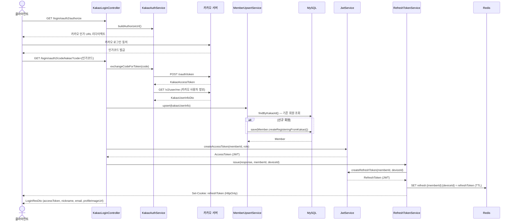
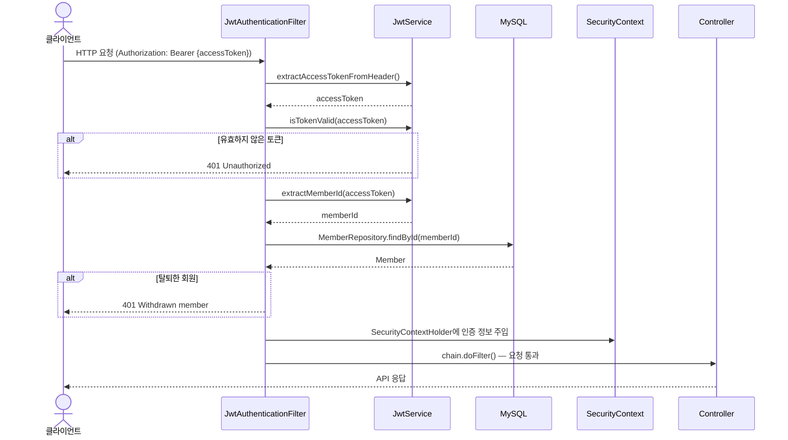
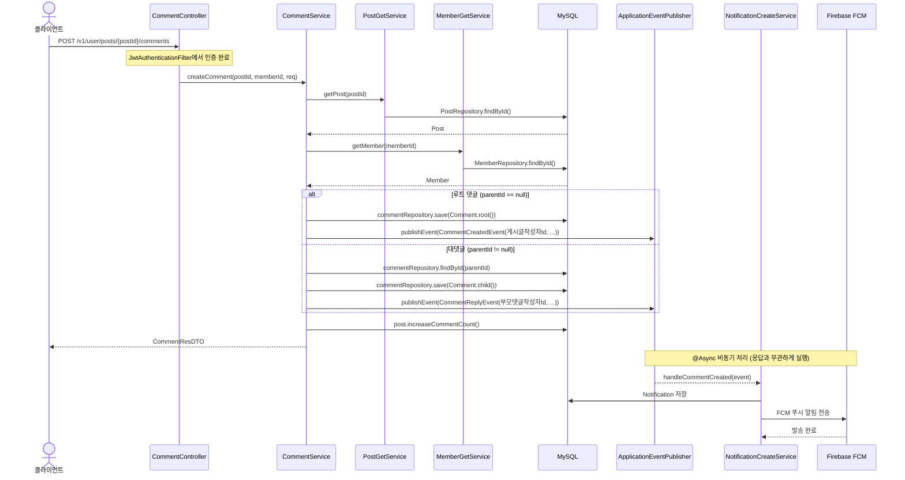
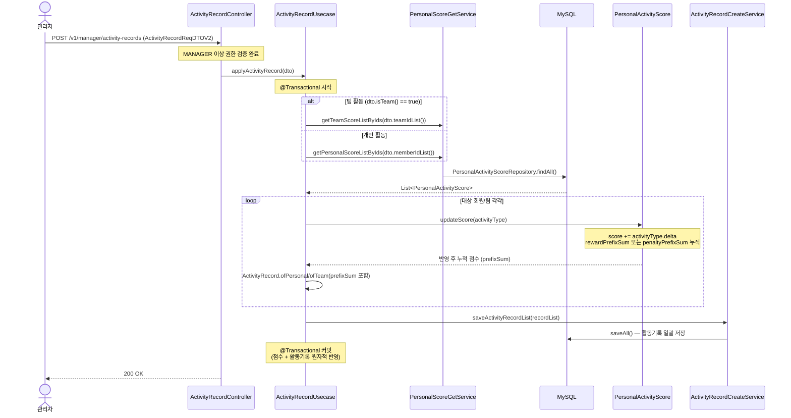

# 아키텍처 & 패턴 가이드

## 레이어 구조

실용적 클린 아키텍처 — **layer-first 패키지**(계층이 최상위, 그 아래 도메인).
의존 방향은 **presentation → application → domain ← infrastructure**.

```
com.tavemakers.surf/
├── presentation/{도메인}/     ← 바깥세상(HTTP)과의 접점
│   ├── controller/               HTTP 요청/응답만. 비즈니스 로직 없음
│   └── dto/{request,response}/
├── application/{도메인}/       ← 유스케이스 오케스트레이션
│   ├── usecase/                  Command(쓰기) 흐름 조합 + @Transactional 경계 소유 + 엔티티→DTO 매핑
│   ├── query/                    읽기 진입점 + 타 도메인이 호출하는 조회 계약 (GetService)
│   ├── mapper/                   presentation DTO ↔ Entity 변환
│   ├── event/                    application(usecase)에 의존하는 리스너
│   ├── scheduler/ task/          주기(cron) 트리거 / 단발 비동기 러너
├── domain/{도메인}/            ← 도메인 규칙·상태
│   ├── entity/                   JPA 엔티티 = 도메인 모델 (의도된 트레이드오프)
│   ├── service/                  단일 책임 도메인 로직. **엔티티를 반환**하고 presentation을 모른다(B안)
│   ├── repository/               Spring Data 인터페이스(사실상 포트 — 구현은 Spring 프록시). 타 도메인 직접 주입 금지
│   ├── event/                    도메인 이벤트 + 도메인에만 의존하는 리스너
│   ├── mapper/                   domain DTO ↔ Entity 변환 (presentation DTO 참조 금지)
│   ├── dto/ exception/ constants/ validator/ util/
├── infrastructure/{도메인}/    ← 외부 연동 어댑터 (S3, FCM, OAuth 클라이언트)
│   └── repository/               손으로 쓴 영속성 구체 클래스만 (QueryDSL·JdbcTemplate 등)
└── global/                     ← 도메인이 아닌 공통 (config·jwt·common·logging·util)
```

> **B안 (도메인 서비스는 DTO를 모른다)**: 도메인 서비스는 원시값/엔티티를 입력받아 **엔티티를 반환**하고,
> `@Transactional`과 Entity↔DTO 매핑은 **usecase**가 소유한다. 이로써 도메인 계층은 presentation 없이
> Spring 컨텍스트 없이 순수 단위테스트(Mockito)가 가능하다. (참조 구조: loopers-labs/loop-pack-be-l2-vol4)
> 단, 엔티티=JPA 엔티티(persistence 결합)는 의도된 트레이드오프로 유지 — 진짜 헥사고날(도메인이 JPA도 모름)까지는 가지 않는다.

### 스테레오타입 책임 정의

| 스테레오타입 | 패키지 | 책임 | @Transactional | 네이밍 |
|---|---|---|---|---|
| **Controller** | `presentation/controller` | HTTP 요청/응답 매핑만 | ✗ | `{Domain}{Action}Controller` |
| **Usecase** | `application/usecase` | Command 오케스트레이션 — 도메인 서비스 + 타 도메인 query 조합, 부수효과 순서 제어 | **경계 소유** | `{Domain}Usecase`, `{Domain}{Action}Usecase` |
| **Query** | `application/query` | 읽기 진입점 + **타 도메인이 호출하는 유일한 조회 계약** | `readOnly` | `{Domain}GetService` |
| **Service** | `domain/service` | **단일 책임** 도메인 로직 (CRUD별 분리). 타 도메인은 `GetService`만 호출 | 세부 관리 | `{Domain}{Action}Service` |
| **Repository** | *선언/구현으로 나뉨* | Spring Data **인터페이스** → `domain/{d}/repository`(사실상 포트). 손으로 쓴 **구체 클래스**(QueryDSL·JdbcTemplate) → `infrastructure/{d}/repository`. 별도 포트 추상화는 두지 않는다(JPA 교체 계획 없음 — 구현 1개짜리 인터페이스 금지) | — | `{Domain}Repository` |
| **Event/Listener** | *의존 계층을 따라감* | 도메인 이벤트 + `@Async @TransactionalEventListener` 리스너 | — | `{X}Event`, `{X}Listener` |
| **Mapper** | *DTO 계층을 따라감* | Entity ↔ DTO 변환 | — | `{Domain}Mapper` |
| **Scheduler / Task** | `application/scheduler`·`task` | 주기 트리거 / 단발 비동기 러너 | — | `{X}Scheduler`, `{X}Task` |

> **Mapper 배치 규칙**: Mapper는 *자신이 만지는 DTO가 속한 계층*에 둔다.
> presentation DTO를 만지면 → `application/mapper` (domain에 두면 **R7 위반**).
> domain DTO만 만지면 → `domain/mapper`.
> 예) `ActivityRecordMapper`(presentation DTO) → application, `PostMapper`(domain DTO) → domain.

> **Listener 배치 규칙** (Mapper와 동일 원리): 리스너는 *자신이 의존하는 가장 바깥 계층*에 둔다.
> `usecase`/`query`를 오케스트레이션하면 → `application/event`, 도메인 서비스·리포지토리만 만지면 → `domain/event`.
> 예) `NotificationEventListener`(NotificationUsecase 호출) → application/event,
> `ScoreMemberDismissListener`·`BadgeMemberDismissListener`(리포지토리만) → domain/event.

> Usecase가 필요 없는 단순 CRUD는 Controller → Service → Repository로 직접 연결한다.
> 여러 서비스 조합·부수효과 순서 제어가 필요하면 **Usecase 하나**로 처리한다 — `facade`라는 별도 스테레오타입은 두지 않는다(usecase가 그 역할을 겸한다).

---

## 네이밍 컨벤션

| 구분 | 패턴 | 예시 |
|------|------|------|
| Service | `{Domain}{Action}Service` | `ActivityRecordCreateService` |
| Usecase | `{Domain}Usecase` | `ActivityRecordUsecase`, `MemberAdminUsecase` |
| Controller | `{Domain}{Action}Controller` | `BadgeCreateController` |
| DTO Request | `{Action}ReqDTO` | `ActivityRecordReqDTO` |
| DTO Response | `{Action}ResDTO` | `AdminActivityRecordResDTO` |
| Exception | `{Domain}{Error}Exception` | `ActivityRecordNotFoundException` |
| Event | `{Domain}{Action}Event` | `CommentCreatedEvent` |

**Action 명칭**: `Create`(POST) / `Get`(GET) / `Patch`(PATCH) / `Delete`(DELETE) / `Put`(PUT)

---

## 주요 패턴

### 1. Usecase 패턴

복합 로직 조합이 필요할 때 사용. `@Transactional`은 Usecase에서만 선언.

```
// 활동기록 생성 흐름 (ActivityRecordUsecase)
ActivityRecordUsecase.createActivityRecordList()
    ├── PersonalScoreGetService.getPersonalScoreListByIds()   // score 도메인 GetService
    ├── PersonalActivityScore.updateScore()                   // 점수 갱신 (엔티티 내 로직)
    └── ActivityRecordCreateService.saveActivityRecordList()  // 활동기록 저장
```

### 2. Event 패턴

도메인 간 알림/로깅 등 부수 효과는 직접 호출 대신 이벤트로 처리

```java
// 이벤트 발행
eventPublisher.publishEvent(new CommentCreatedEvent(...));

// 이벤트 처리
@Async
@EventListener
public void handleCommentCreated(CommentCreatedEvent event) {
    notificationCreateService.createAndSend(...);
}
```

사용 도메인: `comment`, `letter`, `notification`, `post`

### 3. 기타 패턴

| 패턴 | 설명 | 사용 도메인 |
|------|------|-------------|
| **Mapper** | Entity ↔ DTO 변환 분리 (배치는 DTO 계층을 따름) | `post`, `activity` |
| **Scheduler/Task** | 주기적 작업 처리 | `post`, `reservation` |

> **Facade는 폐지**되었다. 복합 도메인 로직 단순화는 **Usecase**가 겸한다
> (`Controller → Usecase → Service`). 과거 `LetterFacade`는 `LetterUsecase`로 통합됐다.

---

## API 경로 규칙

| Prefix | 대상 | 인증 |
|--------|------|------|
| `/v1/user/` | 일반 회원 API | JWT 필요 |
| `/v1/admin/` | 관리자 API | JWT + ADMIN/PRESIDENT 권한 |
| `/v1/manager/` | 매니저 API | JWT + MANAGER 이상 권한 |
| `/login/` | 카카오 OAuth 로그인 | 불필요 |
| `/auth/` | 토큰 재발급 | Refresh Token |

---

## JWT 인증 흐름

```
카카오 로그인
    → /login/oauth2/code/kakao 콜백
    → KakaoOAuthService: 카카오 사용자 정보 조회
    → Member upsert (신규 가입 or 기존 회원 조회)
    → JwtService: Access Token + Refresh Token 발급
    → Refresh Token → Redis 저장
    → 이후 API 요청: Authorization 헤더에 Access Token 포함
```

관련 코드: `global/jwt/`, `domain/login/kakao/`

---

## 공통 응답 구조

모든 API 응답은 `global/common/response/` 의 래퍼로 통일

```json
{
  "isSuccess": true,
  "code": 200,
  "message": "요청에 성공했습니다.",
  "result": { ... }
}
```

예외 처리: `global/common/advice/` (ControllerAdvice)

---

## 시나리오별 코드 흐름

### 시나리오 1 — 카카오 로그인 & JWT 발급


```mermaid
sequenceDiagram
    actor Client as 클라이언트
    participant KC as KakaoLoginController
    participant KAS as KakaoAuthService
    participant Kakao as 카카오 서버
    participant MUS as MemberUpsertService
    participant DB as MySQL
    participant JS as JwtService
    participant RTS as RefreshTokenService
    participant Redis

    Client->>KC: GET /login/oauth2/authorize
    KC->>KAS: buildAuthorizeUrl()
    KAS-->>Client: 카카오 인가 URL 리다이렉트

    Client->>Kakao: 카카오 로그인 동의
    Kakao-->>Client: 인가코드 발급
    Client->>KC: GET /login/oauth2/code/kakao?code={인가코드}

    KC->>KAS: exchangeCodeForToken(code)
    KAS->>Kakao: POST /oauth/token
    Kakao-->>KAS: KakaoAccessToken

    KAS->>Kakao: GET /v2/user/me (카카오 사용자 정보)
    Kakao-->>KAS: KakaoUserInfoDto

    KC->>MUS: upsert(kakaoUserInfo)
    MUS->>DB: findByKakaoId() — 기존 회원 조회
    alt 신규 회원
        MUS->>DB: save(Member.createRegisteringFromKakao())
    end
    DB-->>MUS: Member

    KC->>JS: createAccessToken(memberId, role)
    JS-->>KC: AccessToken (JWT)

    KC->>RTS: issue(response, memberId, deviceId)
    RTS->>JS: createRefreshToken(memberId, deviceId)
    JS-->>RTS: RefreshToken (JWT)
    RTS->>Redis: SET refresh:{memberId}:{deviceId} = refreshToken (TTL)
    RTS-->>Client: Set-Cookie: refreshToken (HttpOnly)

    KC-->>Client: LoginResDto (accessToken, nickname, email, profileImageUrl)
```

---

### 시나리오 2 — 일반 API 요청 인증 흐름

> 로그인 이후 모든 API 요청에서 반복되는 흐름


```mermaid
sequenceDiagram
    actor Client as 클라이언트
    participant Filter as JwtAuthenticationFilter
    participant JS as JwtService
    participant DB as MySQL
    participant SC as SecurityContext
    participant Controller

    Client->>Filter: HTTP 요청 (Authorization: Bearer {accessToken})

    Filter->>JS: extractAccessTokenFromHeader()
    JS-->>Filter: accessToken

    Filter->>JS: isTokenValid(accessToken)
    alt 유효하지 않은 토큰
        JS-->>Client: 401 Unauthorized
    end

    Filter->>JS: extractMemberId(accessToken)
    JS-->>Filter: memberId

    Filter->>DB: MemberRepository.findById(memberId)
    DB-->>Filter: Member

    alt 탈퇴한 회원
        Filter-->>Client: 401 Withdrawn member
    end

    Filter->>SC: SecurityContextHolder에 인증 정보 주입
    Filter->>Controller: chain.doFilter() — 요청 통과
    Controller-->>Client: API 응답
```

---

### 시나리오 3 — 댓글 작성 & 알림 발송 (Event 패턴)


```mermaid
sequenceDiagram
    actor Client as 클라이언트
    participant CC as CommentController
    participant CS as CommentService
    participant PGS as PostGetService
    participant MGS as MemberGetService
    participant DB as MySQL
    participant EP as ApplicationEventPublisher
    participant NS as NotificationCreateService
    participant FCM as Firebase FCM

    Client->>CC: POST /v1/user/posts/{postId}/comments
    Note over CC: JwtAuthenticationFilter에서 인증 완료

    CC->>CS: createComment(postId, memberId, req)

    CS->>PGS: getPost(postId)
    PGS->>DB: PostRepository.findById()
    DB-->>CS: Post

    CS->>MGS: getMember(memberId)
    MGS->>DB: MemberRepository.findById()
    DB-->>CS: Member

    alt 루트 댓글 (parentId == null)
        CS->>DB: commentRepository.save(Comment.root())
        CS->>EP: publishEvent(CommentCreatedEvent(게시글작성자Id, ...))
    else 대댓글 (parentId != null)
        CS->>DB: commentRepository.findById(parentId)
        CS->>DB: commentRepository.save(Comment.child())
        CS->>EP: publishEvent(CommentReplyEvent(부모댓글작성자Id, ...))
    end

    CS->>DB: post.increaseCommentCount()
    CS-->>Client: CommentResDTO

    Note over EP,FCM: @Async 비동기 처리 (응답과 무관하게 실행)
    EP-->>NS: handleCommentCreated(event)
    NS->>DB: Notification 저장
    NS->>FCM: FCM 푸시 알림 전송
    FCM-->>NS: 발송 완료
```

---

### 시나리오 4 — 활동기록 생성 & 점수 즉시 반영 (Usecase 패턴)


```mermaid
sequenceDiagram
    actor Admin as 관리자
    participant AC as ActivityRecordController
    participant ARU as ActivityRecordUsecase
    participant PSGS as PersonalScoreGetService
    participant DB as MySQL
    participant PAS as PersonalActivityScore
    participant ARCS as ActivityRecordCreateService

    Admin->>AC: POST /v1/manager/activity-records (ActivityRecordReqDTOV2)
    Note over AC: MANAGER 이상 권한 검증 완료

    AC->>ARU: applyActivityRecord(dto)
    Note over ARU: @Transactional 시작

    alt 팀 활동 (dto.isTeam() == true)
        ARU->>PSGS: getTeamScoreListByIds(dto.teamIdList())
    else 개인 활동
        ARU->>PSGS: getPersonalScoreListByIds(dto.memberIdList())
    end

    PSGS->>DB: PersonalActivityScoreRepository.findAll()
    DB-->>ARU: List<PersonalActivityScore>

    loop 대상 회원/팀 각각
        ARU->>PAS: updateScore(activityType)
        Note over PAS: score += activityType.delta<br/>rewardPrefixSum 또는 penaltyPrefixSum 누적
        PAS-->>ARU: 반영 후 누적 점수 (prefixSum)
        ARU->>ARU: ActivityRecord.ofPersonal/ofTeam(prefixSum 포함)
    end

    ARU->>ARCS: saveActivityRecordList(recordList)
    ARCS->>DB: saveAll() — 활동기록 일괄 저장
    Note over ARU: @Transactional 커밋<br/>(점수 + 활동기록 원자적 반영)

    AC-->>Admin: 200 OK
```
