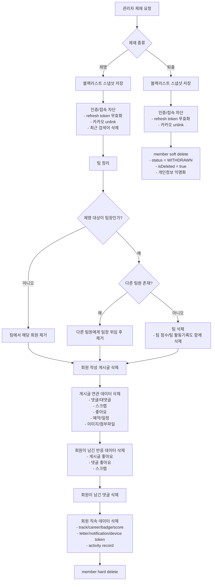
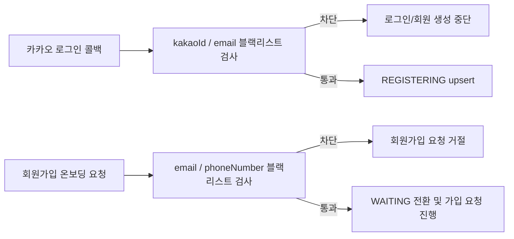
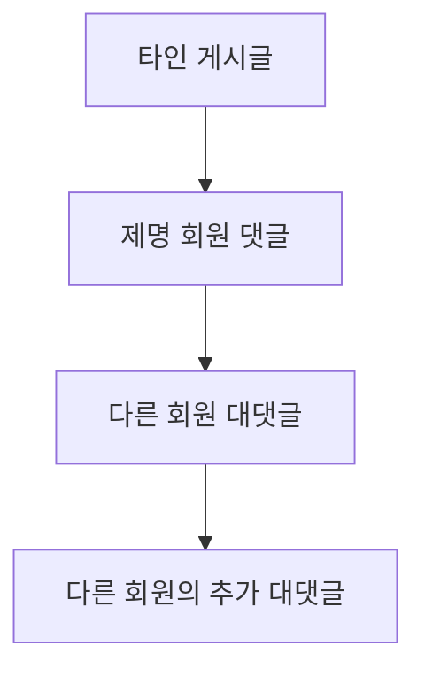

Closes #308

## 승인회원 제명 / 퇴출 / 블랙리스트 구현 및 논의 포인트

이번 작업에서는 `승인된 회원(APPROVED)`에 대해 아래 두 가지 제재 흐름을 기준으로 구현을 진행했습니다.

- `제명`: 블랙리스트 저장 후 연관 활동 데이터를 포함한 **hard delete**
- `퇴출`: 블랙리스트 저장 후 계정 접근을 막는 **soft delete**

또한 재가입 방지를 위해 `블랙리스트`를 별도 저장하고,  
카카오 로그인 진입 시점과 회원가입 온보딩 시점에서 모두 차단하도록 반영했습니다.

### 전체 구조

### 블랙리스트 기준

블랙리스트에는 아래 식별 정보를 스냅샷으로 저장합니다.

- `kakaoId`
- `email`
- `phoneNumber`
- `actionType` (`DISMISS` / `EXPEL`)
- `processedBy`

재가입 차단은 아래 두 시점에서 수행합니다.

### 현재 구현 기준

- `제명` 대상은 `APPROVED` 회원만 허용합니다.
- `퇴출`도 동일하게 블랙리스트에 등록하여 재가입을 막습니다.
- `제명` 시:
  - 팀장이고 다른 팀원이 있으면 첫 번째 다른 팀원에게 팀장을 위임합니다.
  - 팀장이고 다른 팀원이 없으면 팀 자체를 함께 삭제합니다.
  - 회원이 작성한 게시글은 hard delete 되며, 해당 게시글에 달린 댓글/대댓글도 함께 삭제됩니다.
  - 회원이 남긴 좋아요/스크랩/알림/활동기록 등 회원 기반 데이터도 함께 정리됩니다.
- `퇴출` 시:
  - 계정은 soft delete 됩니다.
  - 로그인/재가입은 블랙리스트로 차단됩니다.
  - 기존 활동 기록은 유지됩니다.

### 논의가 필요한 부분

현재 구현에서 **제명 회원이 다른 사람 게시글에 남긴 댓글**은 삭제되지만,  
그 댓글 아래에 **다른 사람이 작성한 대댓글**은 `parent` 연결만 끊고 남기도록 처리되어 있습니다.

즉, 아래 케이스가 남아 있습니다.

현재 동작:

- `제명 회원 댓글(C1)`은 삭제
- `다른 회원 대댓글(C2, C3)`은 완전 삭제되지 않고, 상위 댓글 연결이 끊긴 상태로 남을 수 있음

### 확인 요청

아래 중 어떤 정책으로 갈지 결정이 필요합니다.

1. 제명 회원 댓글 아래 달린 **타인 대댓글까지 전부 삭제**
2. 제명 회원 본인 댓글만 삭제하고, **타인 대댓글은 orphan 형태로 유지**

만약 기획 의도가 “제명 회원 관련 흔적을 가능한 한 모두 제거”라면,  
`1번`으로 가는 것이 더 일관된 정책입니다.
